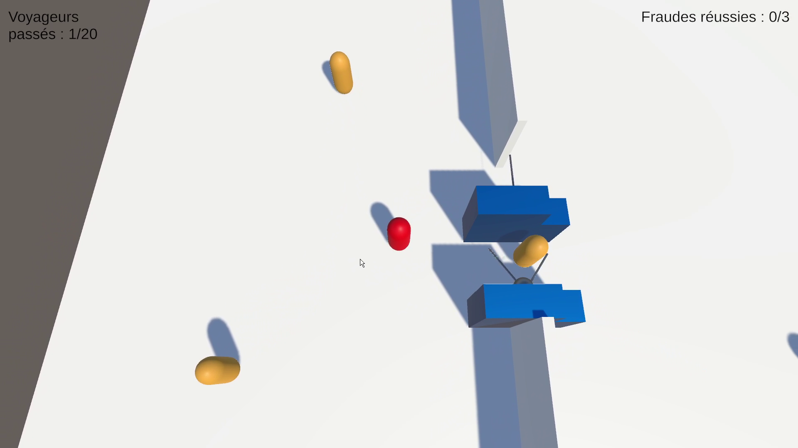
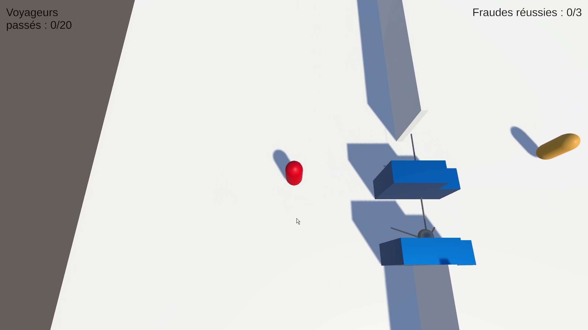
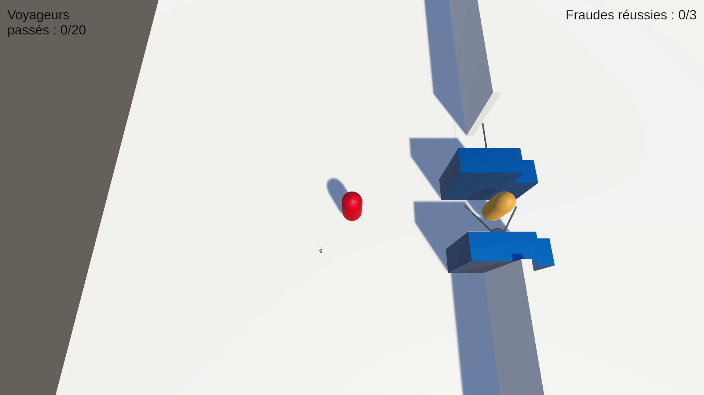
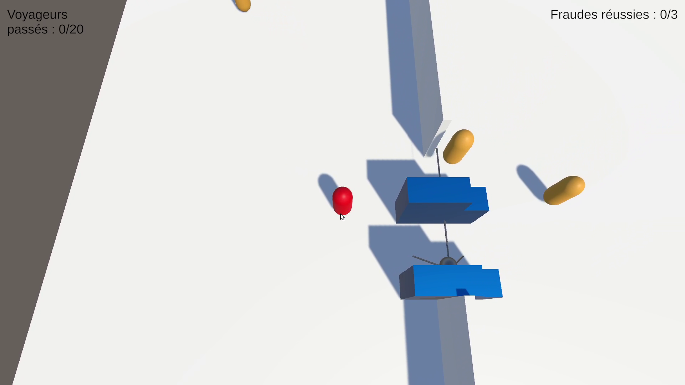
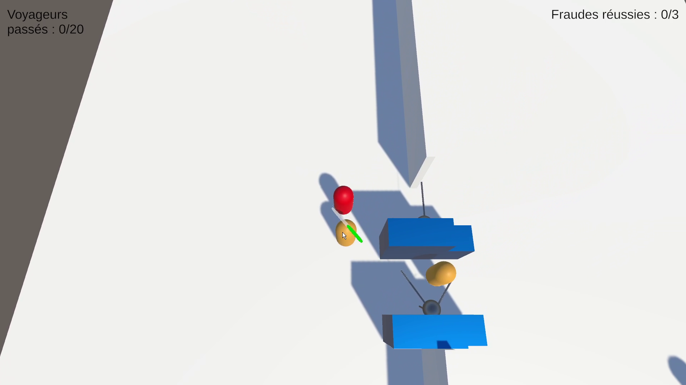
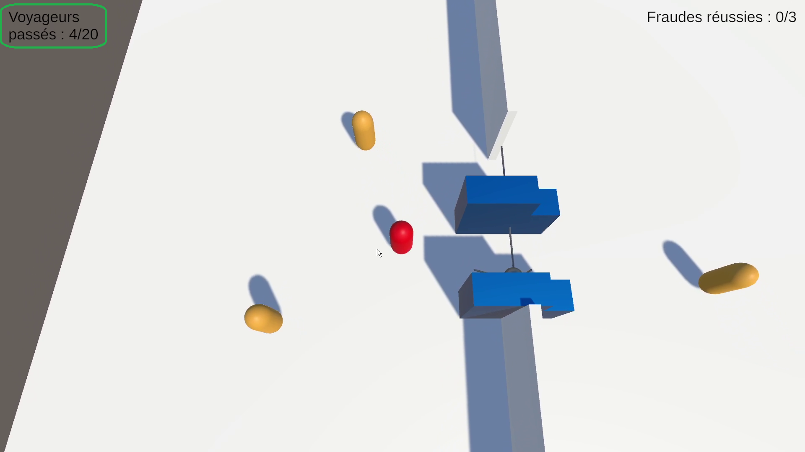
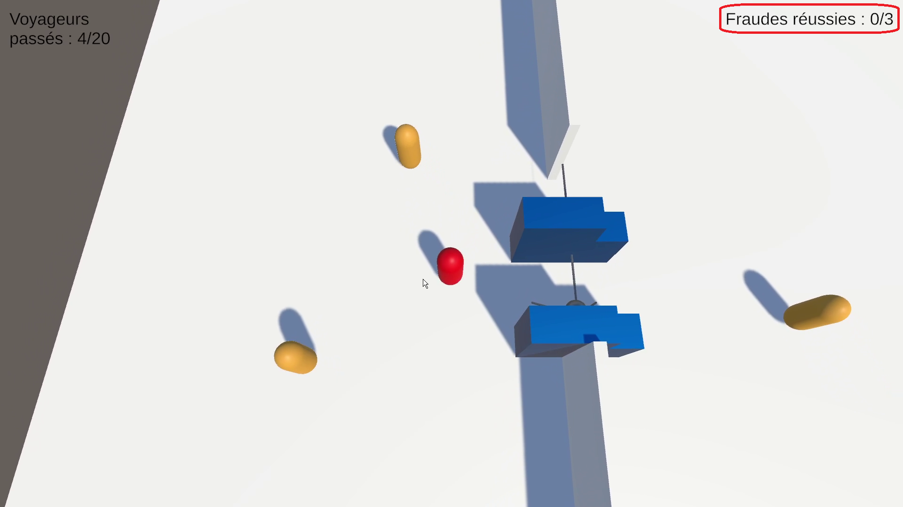

# RATP Agent Game

You, the red capsule, are a RATP agent—the French public company that operates most public transport in Paris and its suburbs. Travelers (yellow capsules) pass through two turnstiles from one side of the station to the other. Some cheat by jumping over a turnstile instead of going through normally. Your goal is to catch these fare dodgers. To do so, you must right-click on them to stop them. Be careful: checks take time, so make sure you only check cheaters and not passengers who are following the rules.

### Move around by right-clicking.

### Some passengers pass through the turnstiles normally.

### Other cheat by jumping over.

### Stop the fare dodgers in order to check their tickets.

### You win when the "Voyageurs passés" (Travelers who have already passed through) count reaches 20.

### But beware! If the "Fraudes réussies" (Successful frauds) count reaches 3, you lose.

